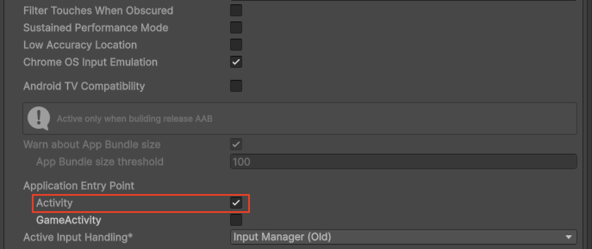
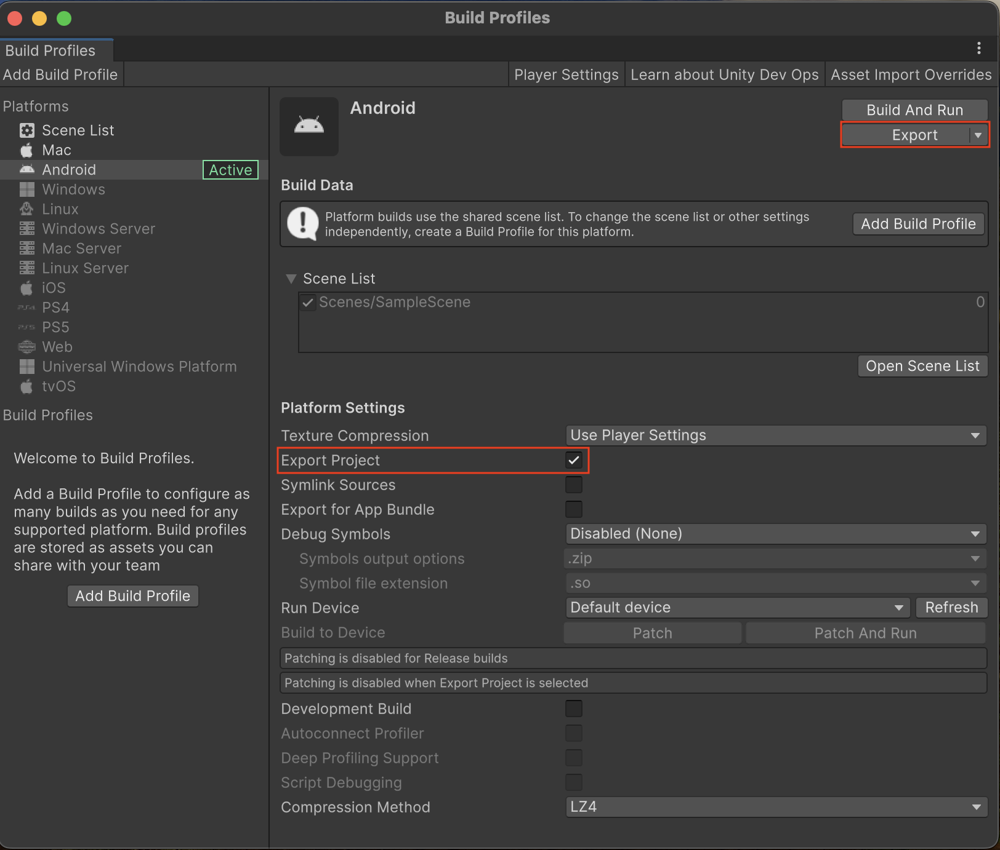
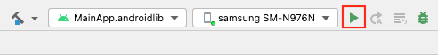
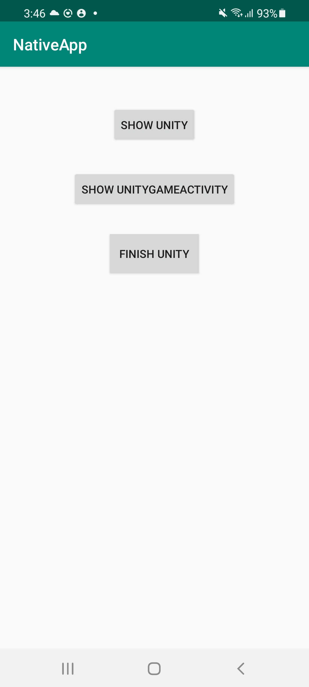
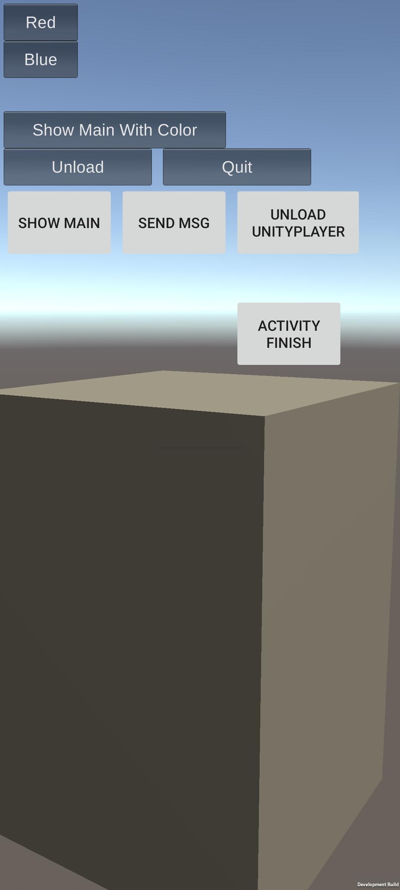
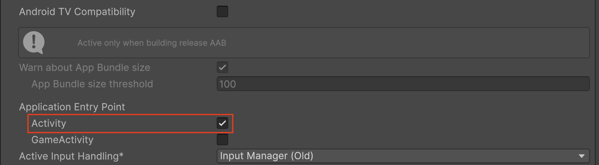
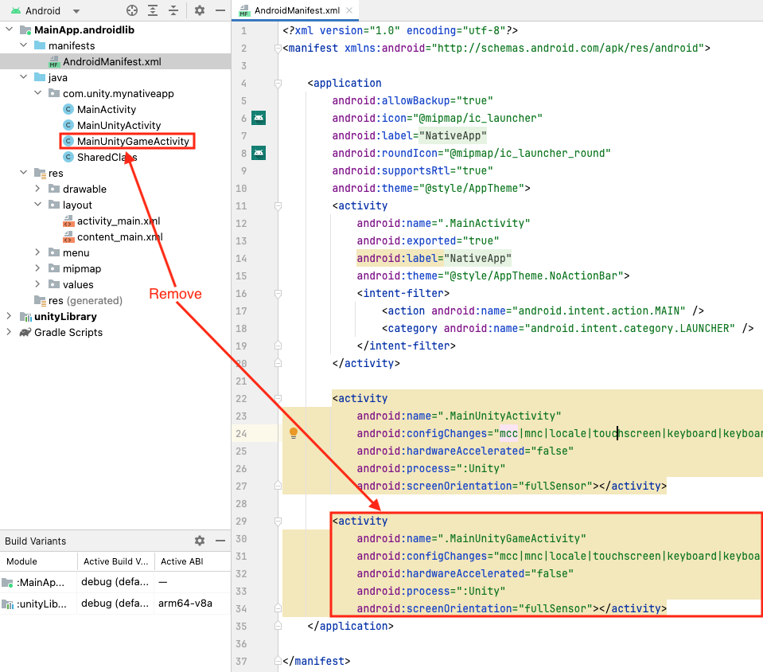
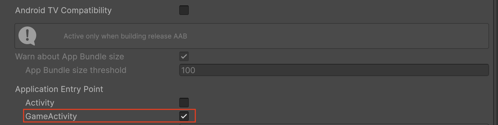
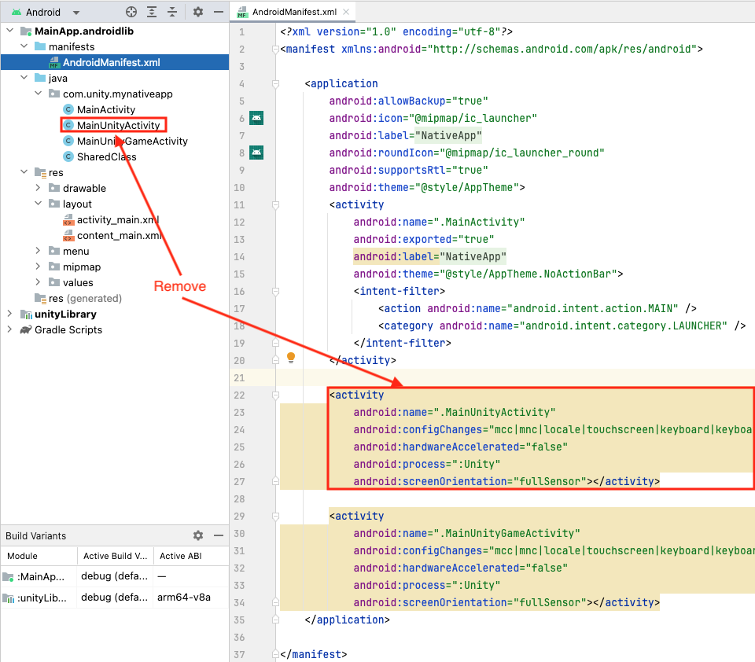

## Integrating Unity as a library into standard Android app
This document explains how to include Unity as a Library into standard Android application through Activity. You can read more about [Unity as a Library](https://docs.unity3d.com/6000.0/Documentation/Manual/UnityasaLibrary.html).

**Requirements:**
- Android Studio Iguana (2023.2.1) or later
- Unity version 6000.0.0b16 or later

**Note**
- For Unity versions from 2019LTS to 2021LTS, use [19LTS-21LTS branch](https://github.com/Unity-Technologies/uaal-example/tree/uaal-example/19LTS-21LTS).
- For Unity version 2022LTS, use [22LTS branch](https://github.com/Unity-Technologies/uaal-example/tree/uaal-example/22LTS).

**1. Get source**
- Clone or Download GitHub repo [uaal-example](https://github.com/Unity-Technologies/uaal-example). It includes:
  ```
  * UnityProject
      *  ...
      * Assets
          * Plugins
              * Android
                  * MainApp.androidlib
      * ...
  ```

  - UnityProject - this is a simple demo project made with Unity which will be exported for the standard Android application.
  - MainApp.androidlib - Inside Unityproject, you can find MainApp.androidlib, which is [Android Library Project](https://docs.unity3d.com/6000.0/Documentation/Manual/android-library-project-import.html) and has a simple UI, with two entries - MainUnityActivity and MainUnityGameActivity.

**2. Generate Gradle project for Android platform**
- Open UnityProject in Unity Editor.
- Go to Build Profiles window (Menu / File / Build Profiles).
  - Select and switch to Android Platform.
- Go to Player Settings window. (Click Player Settings button at the top of Build Profiles or use Edit / Project Settings menu and choose Player tab on the left.)
  - In Other Settings -> Configuration section -> select both Activity and GameActivity as Application Entry Point
    <br>
- Go back to Build Profiles window.
  - Select option “Export Project”, and Export UnityProject to a folder. (If you see Multiple application entries pop-up, click Yes.) 
    <br>

## Project is ready
Everything is ready to build, run and debug:
<br>
<br>If everything succeeded, at this point you should be able to run NativeAndroidApp:

Main Activity | Unity Activity or GameActivity
------------------------ | -------------------------
 | 
Main Activity | Unity is loaded and is running in a separate Activity. Light grey buttons in the middle are added from the MainUnityActivity or MainUnityGameActivity implemented in MainApp.androidlib

## Notes
- Unity is running in another process android:process=":Unity" (AndroidManifest.xml at app module)
- In step 2, if you select only Activity or GameActivy as Application Entry Point, MainUnityActivity.java or MainUnityGameActivity.java file must be deleted.
  - When only Activity is checked as ApplicationEntry Point
    <br>
    <br>
  - When only GameActivity is checked as ApplicationEntry Point
    <br>
    <br>
  
- (Optional) We found some Android 7.* devices set frontOfTask to wrong state for activities, as a result when finishing/quitting Unity activity whole task goes to background instead of bringing back Main activity. Next workaround keeps expected behavior: add the below code to MainUnityActivity.java or UnityPlayerGameActivity.java or both in NativeAndroidApp
  ```
  @Override public void onUnityPlayerQuitted() { SharedClass.showMainActivity(""); finish(); }
  ```

## Recreate an Android activity when using Unity as a library

When using Unity as a library, you can recreate an Android activity without affecting the Unity runtime. This is useful in situations where you require more control over the behavior and lifecycle of your application or when integrating multiple views within your application.

To recreate an activity, consider the following steps:

1. Start an Android activity.
1. Instantiate the `UnityPlayer` as a static variable.
1. Assign it the application context instead of an activity context.

    **Note**: This step disables some functionalities of the `UnityPlayer` that depend on the activity context. Therefore, make sure these are handled explicitly.
1. Use `unload()` to close the activity. This unloads the `UnityPlayer` without destroying it.

    **Note**: Do not use `destroy()` to close the activity.

Reopening the activity uses the same Unity runtime. 

Refer to the following code example:

```
public class UnityActivity extends Activity implements IUnityPlayerLifecycleEvents, IUnityPermissionRequestSupport, IUnityPlayerSupport {
    static com.unity3d.player.UnityPlayerForActivityOrService sUnityPlayer; // Declaring as a static variable allows to reuse the UnityPlayer with subsequent instances of the Activity from the same process

    @Override
    protected void onCreate(Bundle savedInstanceState) {
        super.onCreate(savedInstanceState);
        if (sUnityPlayer == null)
            sUnityPlayer = new UnityPlayerForActivityOrService(getApplicationContext()); // Using the Application context and not the Activity context
        setContentView(sUnityPlayer.getFrameLayout());
        sUnityPlayer.getFrameLayout().requestFocus();
    }

    @Override
    protected void onDestroy ()
    {
        sUnityPlayer.unload(); // Unloading the Player and not destroying it. Application.Quit() should also not be used in C# scripts
        super.onDestroy();
    }

    @Override
    public UnityPlayerForActivityOrService getUnityPlayerConnection() {
        return sUnityPlayer;
    }

    // ... override other functions similarly to UnityPlayerActivity
}
```