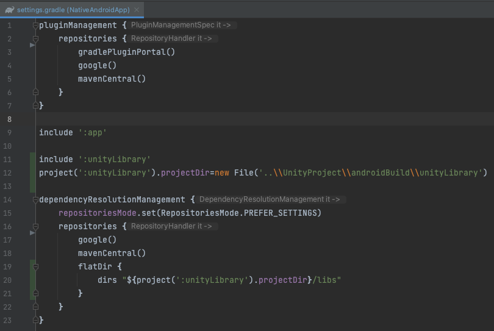
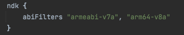

## Integrating Unity as a library into standard Android app
This document explains how to include Unity as a Library into standard Android application through Activity. You can read more about [Unity as a Library](https://docs.unity3d.com/2019.3/Documentation/Manual/UnityasaLibrary.html).

**Requirements:**
- Android Studio Hedgehog (2023.1.1) or later
- Unity version 2023.1.7f1, 2023.2.0b3 or later

[Note] For Unity versions from 2019.3.0b4 to 2022.2.0a17 use [19LTS-21LTS branch](https://github.com/Unity-Technologies/uaal-example/tree/uaal-example/19LTS-21LTS). For Unity versions from 2022.2.0a17 to 2023.1.0a16 use [22LTS branch](https://github.com/Unity-Technologies/uaal-example/tree/uaal-example/22LTS).

**1. Get source**
- Clone or Download GitHub repo [uaal-example](https://github.com/Unity-Technologies/uaal-example). It includes:
  <br>
  - Unityproject - this is a simple demo project made with Unity which will be integrated to the standard Android application
  - NativeAndroidApp - this is the Basic Activity application from Android Studio templates where Unity project will be integrated. It has a simple UI, MainUnityActivity, which extends OverrideUnityActivity, and is prepared to start MainUnityActivity with an Intent 

**2. Generate Gradle project for Android platform**
- Open UnityProject in Unity Editor
- Go to Build Settings window (Menu / File / Build Settings)
  - Select and switch to Android Platform
- Go to Player Settings window (click Player Settings button at the bottom left corner of Build Settings or use Edit / Project Settings menu and choose Player tab on the left)
  - In Other Settings -> Configuration section -> choose targeted architectures
    <br>
  - In Other Settings -> Configuration section -> select both Activity and GameActivity as Application Entry Point
    <br>
- Go back to Build Settings window
  - Select option “Export Project” 
    <br>
  - Export UnityProject to androidBuild folder, the folder structure should look like this
    <br>
    
**3. Add Unity Library module to NativeAndroidApp**
<br>Do the following to add the exported androidBuild/unityLibrary module to the NativeAndroidApp Gradle project in Android Studio:
- Open NativeAndroidApp in Android Studio
- Open settings.gradle file
  - Add a new project pointing to unityLibrary module after the main app module
    ```
    include ':unityLibrary'
    project(':unityLibrary').projectDir=new File('..\\UnityProject\\androidBuild\\unityLibrary')
    ```
  - And add the following in dependencyResolutionManagement{repositories{ block
    ```
    flatDir {
      dirs "${project(':unityLibrary').projectDir}/libs"
    }
    ```
    
- Open build.gradle(Module: NativeAndroidApp.app) file
  - Add the following in dependencies{ block
    ```
    implementation project(':unityLibrary')
    implementation fileTree(dir: project(':unityLibrary').getProjectDir().toString() + ('\\libs'), include: ['*.jar'])
    ```
    
  
  - In the same file take a look at android{defaultConfig{ndk{ block and make sure abiFilters match the architectures you selected in Unity editor before exporting the project. The filter must match architectures in Unity editor exactly. If Unity exports only ARMv7 architecture, but the filter includes arm64-v8a, the application will crash on ARM64 devices. Check for valid abiFilters values in the [official Android documentation](https://developer.android.com/ndk/guides/abis#sa).
  <br>

- Copy the contents of the gradle.properties file from the exported Unity project root folder to the gradle.properties file in the native application root folder. Note: if you update the Unity project and re-export it again, make sure that the contents of the gradle.properties file in the exported project did not change. If they did - repeat this step.
  <br>
- Click Sync Now to do a project sync since Gradle files have been modified
  
- If everything succeeds, you should see unityLibrary module added in Android view
  

## Project is ready
Everything is ready to build, run and debug:
<br>
<br>If everything succeeded, at this point you should be able to run NativeAndroidApp:

Main Activity | Unity Activity or GameActivity
------------------------ | -------------------------
 | 
Main Activity | Unity is loaded and is running in a separate Activity. Light grey buttons in the middle are added from the MainUnityActivity or MainUnityGameActivity implemented in NativeAndroidApp

## Notes
- If the console displays error messages like the image below, open Package Manager and remove or install Ugui or Unity UI package depending on the version of Unity Editor.
  <br>
  <br>
  <br>
  <br>
- Unity is running in another process android:process=":Unity" (AndroidManifest.xml at app module)
- After installation there will be two or three icons added on the device. To leave only the icon of the main activity, remove `<intent-filter>...</intent-filter>` from the AndroidManifest.xml in unityLibrary
  <br>
- In step 2, if you select only Activity or GameActivy as Application Entry Point, MainUnityActivity.java or MainUnityGameActivity.java file must be deleted.
  - When only Activity is checked as ApplicationEntry Point
    <br>
    <br>
  - When only GameActivity is checked as ApplicationEntry Point
    <br>
    <br>
  
- (Optional) We found some Android 7.* devices set frontOfTask to wrong state for activities, as a result when finishing/quitting Unity activity whole task goes to background instead of bringing back Main activity. Next workaround keeps expected behavior: add the below code to MainUnityActivity.java or UnityPlayerGameActivity.java or both in NativeAndroidApp
  ```
  @Override public void onUnityPlayerQuitted() { SharedClass.showMainActivity(""); finish(); }
  ```
