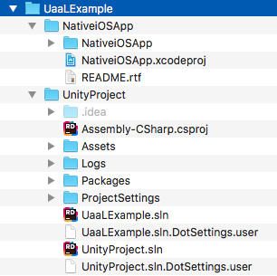
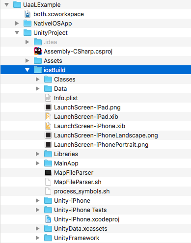
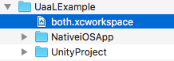
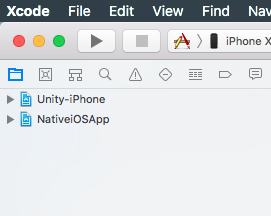
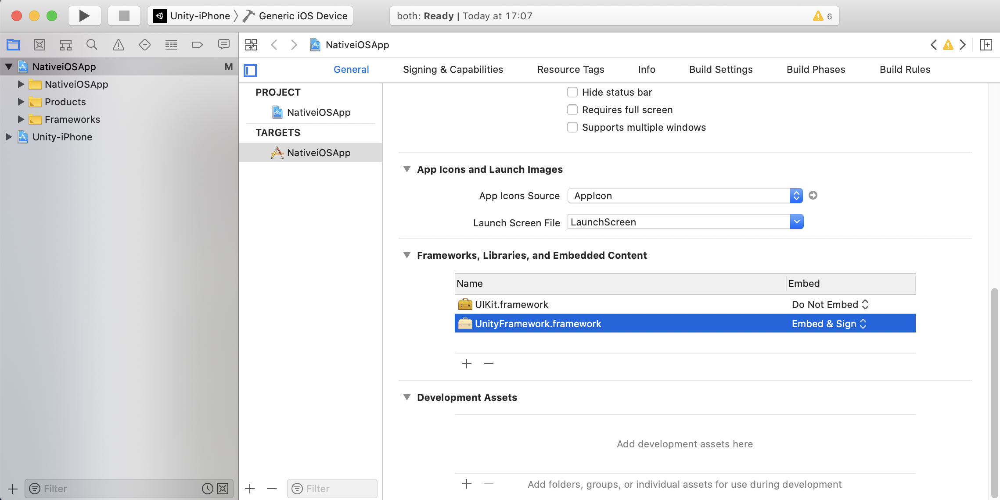
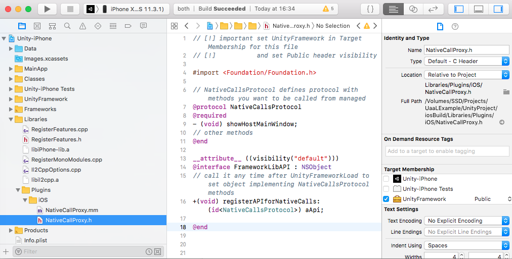
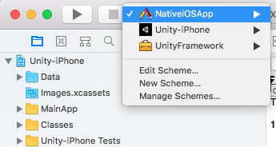
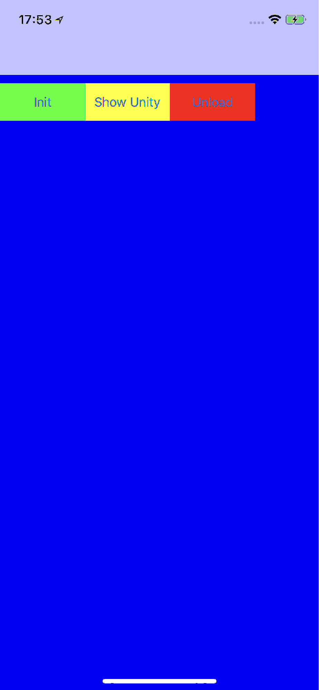
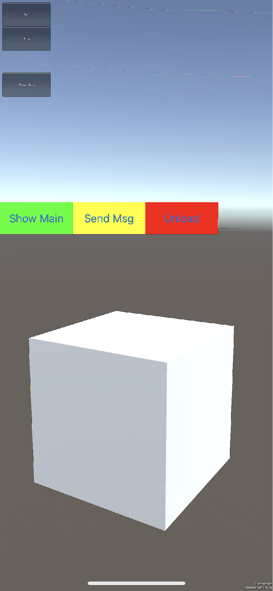

## Integrating Unity as a library into standard iOS app
This document explains how to include Unity as a Library into standard iOS application. You can read more about [Unity as a Library](https://docs.unity3d.com/2019.3/Documentation/Manual/UnityasaLibrary.html).

**Requirements:**
- Xcode 9.4+
- Unity version 2019.3.0b11+, 2020.1.0a13+

**1. Get source**
- Clone or Download GitHub repo [uaal-example](https://github.com/Unity-Technologies/uaal-example). It includes:
  <br>
  - UnityProject - this is a simple demo project made with Unity which will be integrated to the standard iOS application. Assets / Plugins / iOS files used to communicate from Unity player to Native app
  - NativeiOSApp - this is simple Xcode single view application where we want to integrate our Unity project. It has some UI and is prepared to load player with UnityFrameworkLoad() 

**2. Generate Xcode project for iOS**
<br>Nothing new here just generate Xcode project as usual:
- from Unity Editor open UnityProject 
- set valid Bundle Identification and Signing Team ID ( to avoid Xcode signing issues on later steps )  (Menu / Edit / Project Settings / Player / iOS Setting tab / Other Settings / Identification Section)
- select and switch to platform iOS (Menu / File / Builds Settings)
  - Build inside UnityProject to iosBuild folder
    <br>
    
**3. Setup Xcode workspace**
<br>Xcode workspace allows to work on multiple projects simultaneously and combine their products
- open NativeiOSApp.xcodeproj from Xcode
- create workspace and save it at UaaLExample/both.xcworkspace. (File / New / Workspace)
  <br>
- close NativeiOSApp.xcodeproj project all Next steps are done from just created Workspace project
- add NativeiOSApp.xcodeproj and generated Unity-iPhone.xcodeproj from step #2 to workspace on a same level ( File / Add Files to “both” )
  <br>

**4. Add UnityFramework.framework**
<br>With this step we add Unity player in the form of a framework to NativeiOSApp, it does not change the behavior of NativeiOSApp yet
- select NativeiOSApp target from NativeiOSApp project
- in "General" tab / "Frameworks, Libraries, and Embedded  Content" press +
- Add Unity-iPhone/UnityFramework.framework
  <br>
- in "Build Phases" tab, expand "Link Binary With Libraries"
- remove UnityFramework.framework from the list (select it and press - )
  <br>

**5. Expose NativeCallProxy.h**
<br>Native application implements NativeCallsProtocol defined in following file:
- In Project navigator, find and select Unity-iPhone / Libraries / Plugins / iOS / NativeCallProxy.h
- enable UnityFramework in Target Membership and set header visibility from project to public (small dropdown on right side to UnityFramework)
  <br>
  
 **6. Make Data folder to be part of the UnityFramework**
 <br>By default Data folder is part of Unity-iPhone target, we change that to make everything encapsulated in one single framework file.
 - change Target Membership for Data folder to UnityFramework
   <br>
 - (optional) If you want to use Unity-iPhone sheme you need to point UnityFramework to a new place where Data is located by calling from Unity-iPhone/MainApp/main.mm:
   ```
   [ufw setDataBundleId: "com.unity3d.framework"];
   // On Demand Resources are not supported in this case. To make them work instead of the calls above 
   // you need to copy Data folder to your native application (With script at Build Phases) and 
   // skip a calls above since by default Data folder expected to be in mainBundle.
   ```
   <br>
  
## Workspace is ready
Everything is ready to build, run and debug for both projects: Unity-iPhone and NativeiOSApp (select NativeiOSApp scheme to run Native App with integrated Unity or Unity-iPhone to run just Unity App part)
<br>
If all went successfully at this point you should be able to run NativeiOSApp:

Native View | Unity View
------------ | -------------
 | 
Unity is not loaded, click Init to load unity framework and show its view. | Unity is loaded and running, colorful buttons in the middle are added by NativeiOSApp to Unity View.

## Notes
**Loading**
Unity player is controlled with UnityFramework object. To get it you call UnityFrameworkLoad (it loads UnityFramework.framework if it wasn't, and returns singleton instance to UnityFramework class observe Unity-iPhone/UnityFramework/UnityFramework.h for its API ). 
Observe UnityFrameworkLoad in: NativeiOSApp/NativeiOSApp/MainViewController.mm or in Unity-iPhone/MainApp/main.mm
```
#include <UnityFramework/UnityFramework.h>

UnityFramework* UnityFrameworkLoad()
{
    NSString* bundlePath = nil;
    bundlePath = [[NSBundle mainBundle] bundlePath];
    bundlePath = [bundlePath stringByAppendingString: @"/Frameworks/UnityFramework.framework"];

    NSBundle* bundle = [NSBundle bundleWithPath: bundlePath];
    if ([bundle isLoaded] == false) [bundle load];

    UnityFramework* ufw = [bundle.principalClass getInstance];
    if (![ufw appController])
    {
        // Initialize Unity for a first time
        [ufw setExecuteHeader: &_mh_execute_header];       

        // Keep in sync with Data folder Target Membership setting
        [ufw setDataBundleId: "com.unity3d.framework"]; 
       
    }
    return ufw;
}
```
