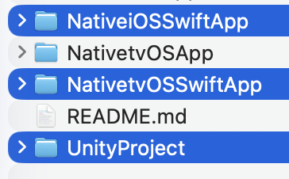

## Integrating Unity as a library (Swift Project Type) into standard Swift based iOS / tvOS application
This document explains how to include Unity as a Library (Swift Project Type) into standard iOS / tvOS Swift based application. You can read more about [Unity as a Library](https://docs.unity3d.com/2019.3/Documentation/Manual/UnityasaLibrary.html).

**Requirements:**
- Minimum iOS / tvOS Version 16.0+
- Xcode 16.0+
- Unity version 6000.7+

**Notes:**
- Integration steps for tvOS are the same as for iOS

**Integration:**
**1. Get source**
- Clone or Download GitHub repo [uaal-example](https://github.com/Unity-Technologies/uaal-example). It includes:
  <br>
  - **UnityProject**
  this is a simple Unity demo project which will be integrated to the iOS Native host application. Assets / Plugins / iOS files used to communicate Unity player with Native app

  - **NativeiOSSwiftApp** / **NativetvOSSwiftApp**
  this is default Xcode SwiftUI based application where we going to integrate our Unity project. It has some UI controls for UaaL to showcase life cycle and almost prepared to run Unity Player, except for key integration steps that we will do manually.
  
**2. Generate Xcode Swift Project for iOS**
<br>Nothing new here just generate Xcode project as usual:
- from Unity Editor open UnityProject 
- set valid Bundle Identification and Signing Team ID ( to avoid Xcode signing issues on later steps )  (Menu / Edit / Project Settings / Player / iOS Setting tab / Other Settings / Identification Section)
- select and switch to platform iOS (Menu / File / Builds Settings)
- ⚠️ select Swift Project Type from (Player Settings / Other Settings / Configuration / Xcode project type)
- Build inside UnityProject to iosBuild folder
  <br>
    
**3. Setup Xcode workspace**
<br>Xcode workspace allows to work on multiple projects simultaneously and combine their products
- open NativeiOSSwiftApp.xcodeproj from Xcode (or NativetvOSSwiftApp.xcodeproj for tvOS)
- create workspace and save it at uaal-example/both.xcworkspace. (File / New / Workspace)
  <br>
- close NativeiOSSwiftApp.xcodeproj project all Next steps are done from just created Workspace project
- add NativeiOSSwiftApp.xcodeproj and generated UaaLExample.xcodeproj from step #2 to workspace on a same level ( File / Add Files to "both" )
  <br>

**4. Add UnityFramework.framework**
<br>With this step we add Unity player (UnityFramework.framework) to NativeiOSSwiftApp. 
- select NativeiOSSwiftApp target from NativeiOSSwiftApp project
- in "General" tab / "Frameworks, Libraries, and Embedded  Content" press +
- Add Workspace/UaaLExample/UnityFramework.framework
 <br>

Note: UaaL with Swift Project Type requires static UnityFramework.framework loading. The framework binary is loaded before main() of your host application. This means static initializers run before main, app launch time will slightly increase, and memory usage will increase.

**5. NativeCallProxy — Unity -> Native Host**
<br>The Unity project includes a Swift-native plugin at Assets/Plugins/iOS/NativeCallProxy.swift that defines the bridge between Unity C# code and the native host app. This file is compiled into UnityFramework and its public types are automatically visible to the host app — no header exposure or umbrella header changes needed (as in Objective-C integration).

The plugin defines:
- `NativeCallsProtocol` — protocol your host app conforms to for receiving calls from Unity
- `FrameworkLibAPI` — registration point to connect your protocol implementation
- `@_cdecl` functions — C symbols that IL2CPP calls via `[DllImport("__Internal")]`

In the host app, add `import UnityFramework` to access these types.

**Native Host → Unity (Host Swift calling C#):**
```swift
UnityPlayer.shared.sendMessage(toGameObject: "Cube", method: "ChangeColor", argument: "red")
```

 **6. Make Data folder to be part of the UnityFramework**
 <br>In UaaLExample project Data folder is part of Unity-iPhone target by default, we change that to be part of UnityFramework target to make data encapsulated in one single file UnityFramework.framework.
 - change Target Membership for Data folder to UnityFramework
   <br>
 - (optional) If you want UaaLExample scheme to continue to work after change above you need to override `AppDelegate.application(_:didFinishLaunchingWithOptions:)` to set the framework bundle id before Unity initializes, in uaal-example/UnityProject/iosBuild/UnityAPI/AppIntegration/AppDelegate.swift:
   ```swift
    override func application(_ application: UIApplication, didFinishLaunchingWithOptions launchOptions: [UIApplication.LaunchOptionsKey : Any]? = nil) -> Bool {
        UnitySetDataBundleDirWithBundleId("com.unity3d.framework")
        return UnityPlayer.shared.application(application, didFinishLaunchingWithOptions: launchOptions)
    }
   ```
   <br>
  
## Workspace is ready
Everything is ready to build, run and debug both projects: UaaLExample and NativeiOSSwiftApp (select NativeiOSSwiftApp scheme to run Native Swift Application with integrated Unity or UaaLExample to run just Unity Application part)
<br>
If all went successfully at this point you should be able to run NativeiOSSwiftApp:

Native View | Unity View
------------ | -------------
 | 
Unity is not initialized, click Init to start Unity engine and show its view. | Unity is running, colorful buttons below are added by the host app as overlay on Unity View.

## UnityPlayer API

**Engine lifecycle:**
```swift
// Start engine (first call initializes, subsequent calls reload after unload)
UnityPlayer.shared.startEngine()

// Unload — posts UnityNotifications.unityDidUnload when complete
// Engine can be brought back with startEngine()
UnityPlayer.shared.unload()

// Quit — posts UnityNotifications.unityDidQuit when complete
UnityPlayer.shared.quit()
```

**Embedding setup:**
```swift
// Set before startEngine() in any embedding scenario to keep the process alive after quit
UnityPlayer.shared.terminatesOnQuit = false

// Point Unity data to the framework bundle (UaaL only, call before startEngine)
UnitySetDataBundleDirWithBundleId("com.unity3d.framework")
```

**Rendering view:**
```swift
// Metal-backed UIView, available after startEngine()
// Wrap in a UIViewRepresentable for SwiftUI usage
let view = UnityPlayer.shared.renderingView
```

**Pause / resume:**
```swift
UnityPlayer.shared.pause()
UnityPlayer.shared.resume()
UnityPlayer.shared.isPaused()
```

**Messaging (Native → Unity):**
```swift
UnityPlayer.shared.sendMessage(toGameObject: "Cube", method: "ChangeColor", argument: "red")
```

**Scene lifecycle forwarding (call from your SceneDelegate):**
```swift
UnityPlayer.shared.sceneDidBecomeActive(scene)
UnityPlayer.shared.sceneWillResignActive(scene)
UnityPlayer.shared.sceneDidEnterBackground(scene)
UnityPlayer.shared.sceneWillEnterForeground(scene)
```

**Notifications:**
- `UnityNotifications.unityDidInitializeRuntime` — engine runtime initialized (first start only)
- `UnityNotifications.unityDidUnload` — engine unloaded, can be restarted
- `UnityNotifications.unityDidQuit` — engine quit, cannot be restarted
