## Integrating Unity as a library (Swift Project Type) into standard Swift based iOS application
This document explains how to include Unity as a Library (Swift Project Type) into standard iOS Swift based application. You can read more about [Unity as a Library](https://docs.unity3d.com/2019.3/Documentation/Manual/UnityasaLibrary.html).

**Requirements:**
- Minimum iOS Version 16.0+
- Xcode 14.0+ ‼️ align with requrements for 6000.7
- Unity version 6000.7+

**Notes:**
- Integration steps for tvOS are exactly the same as of iOS

**Integration:**
**1. Get source**
- Clone or Download GitHub repo [uaal-example](https://github.com/Unity-Technologies/uaal-example). It includes:
‼️ update image after tvOSExample added
  <br>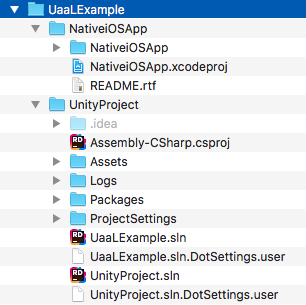
  - UnityProject
  this is a simple Unity demo project which will be integrated to the standard iOS application. Assets / Plugins / iOS files used to communicate Unity player with Native app

  - NativeiOSSwiftApp / NativetvOSSwiftApp
  this is default Xcode SwiftUI based application where we going to integrate our Unity project. It has some UI controls for UaaL to showcase life cycle and almost prepared to run Unity Player, except for most important steps that we will do manually.

**2. Generate Xcode Swift Project for iOS**
<br>Nothing new here just generate Xcode project as usual:
- from Unity Editor open UnityProject 
- set valid Bundle Identification and Signing Team ID ( to avoid Xcode signing issues on later steps )  (Menu / Edit / Project Settings / Player / iOS Setting tab / Other Settings / Identification Section)
- select and switch to platform iOS (Menu / File / Builds Settings)
- ⚠️ select Swift Project Type from (Player Settings / Other Settings / Configuration / Xcode project type)
- Build inside UnityProject to iosBuild folder
  <br>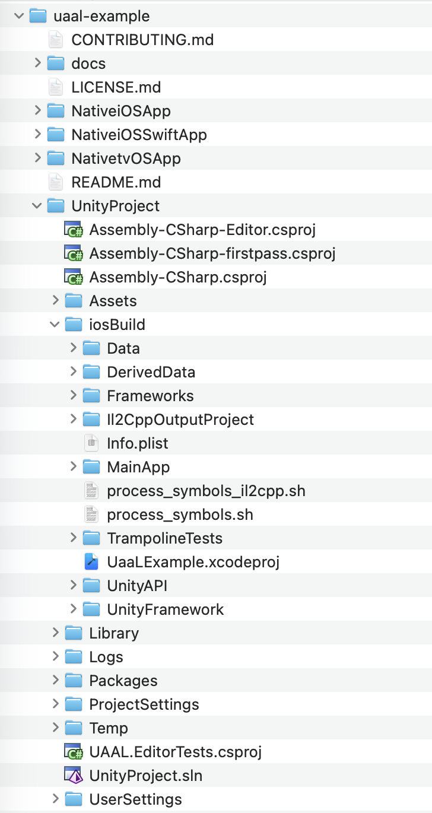
    
**3. Setup Xcode workspace**
<br>Xcode workspace allows to work on multiple projects simultaneously and combine their products
- open NativeiOSSwiftApp.xcodeproj from Xcode
- create workspace and save it at uaal-example/both.xcworkspace. (File / New / Workspace)
  <br>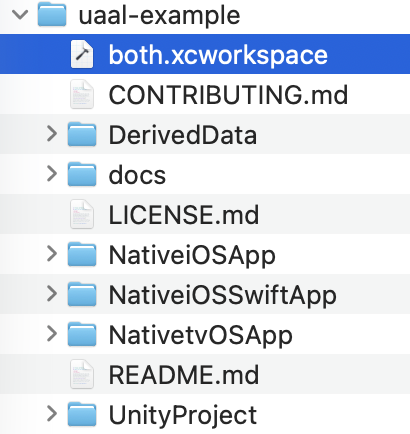
- close NativeiOSSwiftApp.xcodeproj project all Next steps are done from just created Workspace project
- add NativeiOSSwiftApp.xcodeproj and generated UaaLExample.xcodeproj from step #2 to workspace on a same level ( File / Add Files to “both” )
  <br>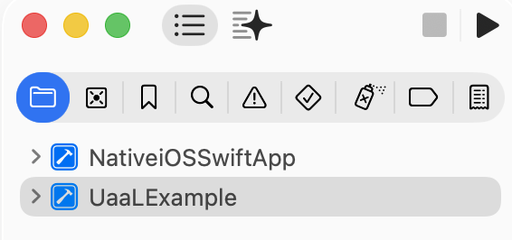

**4. Add UnityFramework.framework**
<br>With this step we add Unity player in the form of a framework to NativeiOSSwiftApp. 
⚠️ UaaL with Swift Project Type supported only via static UnityFramework.framewok loading, after this step UnityFramework.framework binary will be loaded before main() method of your host application. Static initializer of Unity Project will be called before main, also you app launch time will slightly increase, memory usage will increase.
- select NativeiOSSwiftApp target from NativeiOSSwiftApp project
- in "General" tab / "Frameworks, Libraries, and Embedded  Content" press +
- Add Workspace/UaaLExample/UnityFramework.framework
 <br>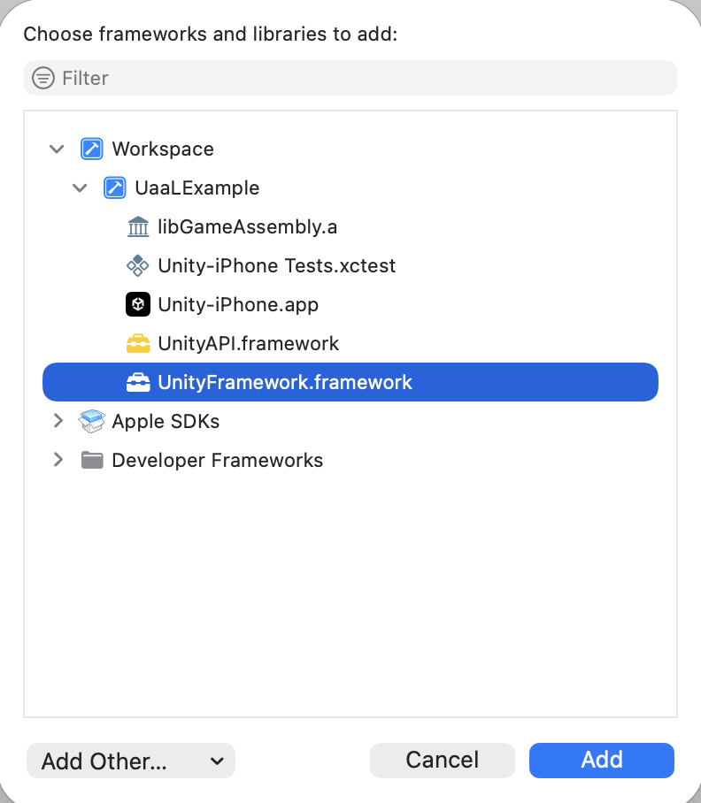

**5. Expose NativeCallProxy.h**
<br>Native application implements NativeCallsProtocol defined in following file:
- In Project navigator, find and select Unity-iPhone / Libraries / Plugins / iOS / NativeCallProxy.h
- enable UnityFramework in Target Membership and set header visibility from project to public (small dropdown on right side to UnityFramework)
  <br>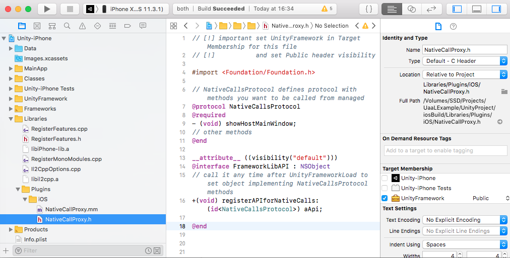
  
 **6. Make Data folder to be part of the UnityFramework**
 <br>In UaaLExample project Data folder is part of Unity-iPhone target by default, we change that to be part of UnityFramework target to make data encapsulated in one single file UnityFramework.framework.
 - change Target Membership for Data folder to UnityFramework
   <br>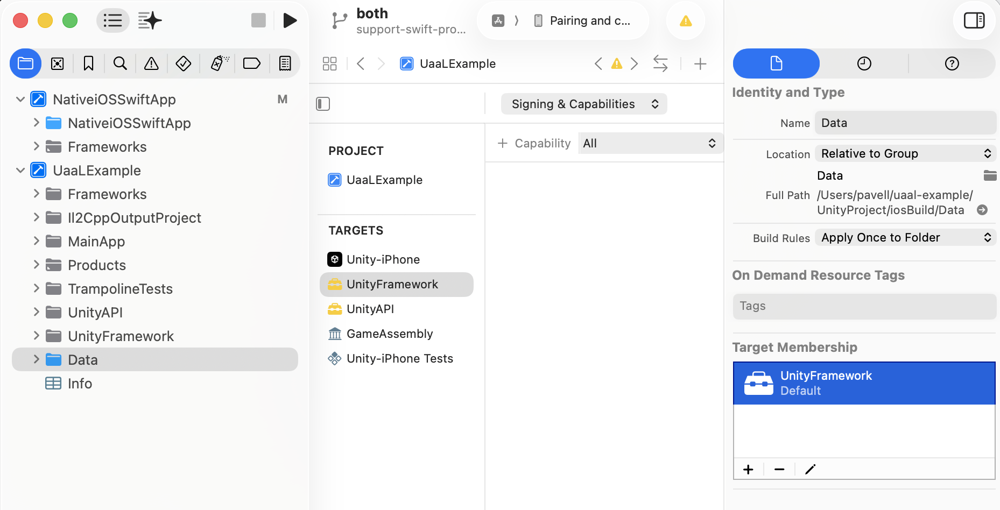
 - (optional) If you want UaaLExample sheme to continue to work after change above you need to call UnitySetDataBundleDirWithBundleId("com.unity3d.framework") to point where Data is located in uaal-example/UnityProject/iosBuild/UnityAPI/AppIntegration/AppDelegate.swift:
   ```
    public func application(_ application: UIApplication, willFinishLaunchingWithOptions launchOptions: [UIApplication.LaunchOptionsKey : Any]? = nil) -> Bool {
        UnitySetDataBundleDirWithBundleId("com.unity3d.framework")
        return UnityPlayer.shared.application(application, willFinishLaunchingWithOptions: launchOptions)
    }
   ```
   <br>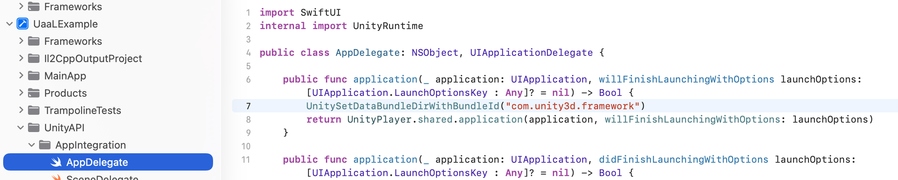
  
## Workspace is ready
Everything is ready to build, run and debug both projects: UaaLExample and NativeiOSSwiftApp (select NativeiOSSwiftApp scheme to run Native Swift Application with integrated Unity or UaaLExample to run just Unity Application part)
<br>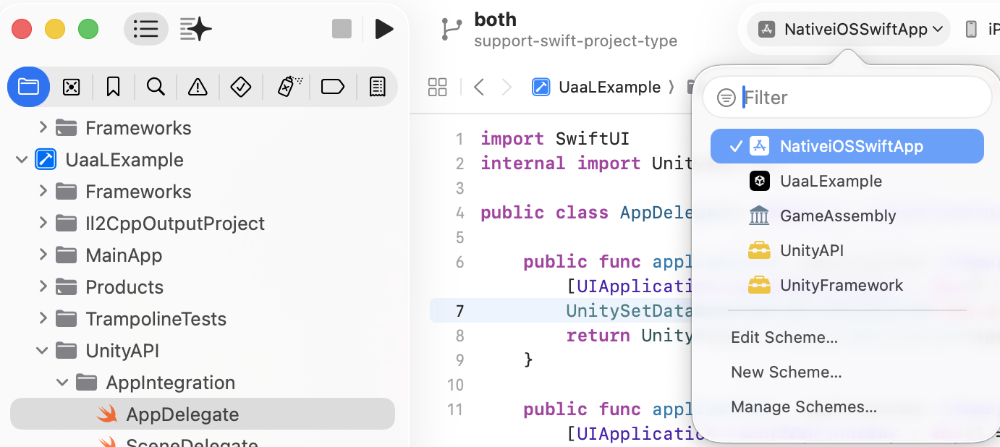
If all went successfully at this point you should be able to run NativeiOSSwiftApp:

Native View | Unity View
------------ | -------------
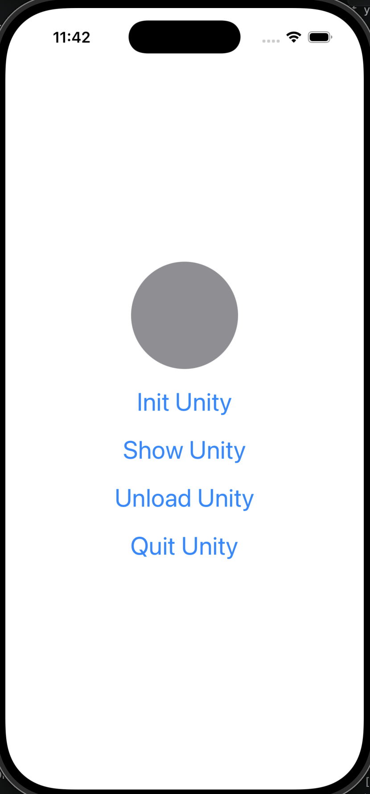 | 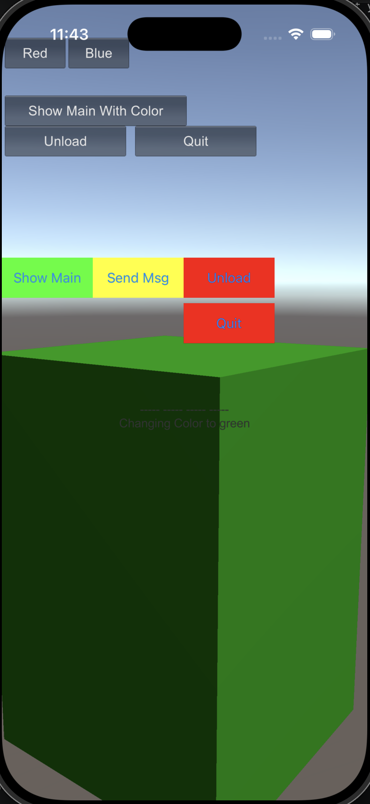
Unity is not loaded(‼️ be more precise), click Init to load unity framework and show its view. | Unity is loaded and running, colorful buttons in the middle are added by NativeiOSApp to Unity View.

## Notes
**Loading**
‼️ (Loading works diffrently for swift) Unity player is controlled with UnityFramework object. To get it you call UnityFrameworkLoad (it loads UnityFramework.framework if it wasn't, and returns singleton instance to UnityFramework class observe Unity-iPhone/UnityFramework/UnityFramework.h for its API ). 
Observe UnityFrameworkLoad in: NativeiOSApp/NativeiOSApp/MainViewController.mm or in Unity-iPhone/MainApp/main.mm
```
#include <UnityFramework/UnityFramework.h>

UnityFramework* UnityFrameworkLoad()
{
    NSString* bundlePath = nil;
    bundlePath = [[NSBundle mainBundle] bundlePath];
    bundlePath = [bundlePath stringByAppendingString: @"/Frameworks/UnityFramework.framework"];

    NSBundle* bundle = [NSBundle bundleWithPath: bundlePath];
    if ([bundle isLoaded] == false) [bundle load];

    UnityFramework* ufw = [bundle.principalClass getInstance];
    if (![ufw appController])
    {
        // Initialize Unity for a first time
        [ufw setExecuteHeader: &_mh_execute_header];       

        // Keep in sync with Data folder Target Membership setting
        [ufw setDataBundleId: "com.unity3d.framework"]; 
       
    }
    return ufw;
}
```
